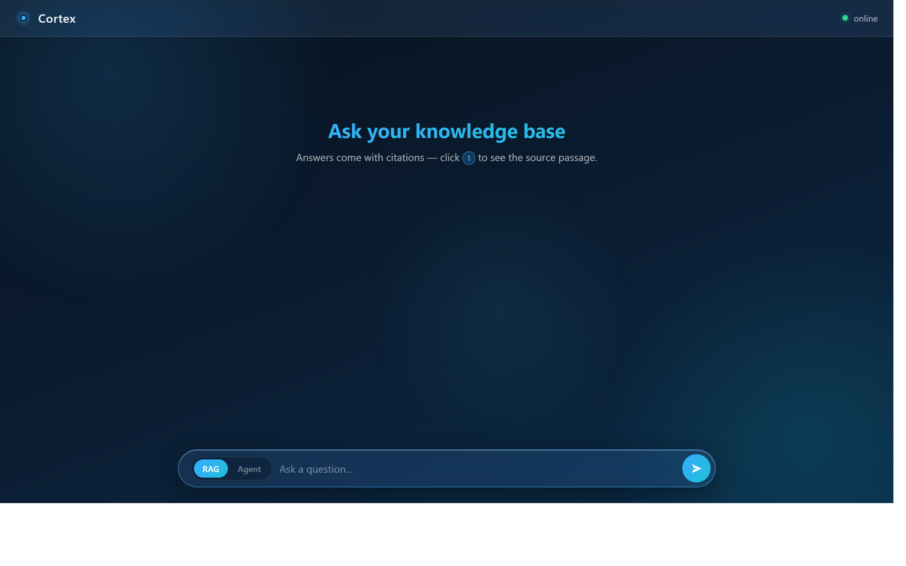

# Cortex — Agentic RAG Knowledge Assistant

[](https://github.com/ALTERLK/cortex/actions/workflows/ci.yml)
[](LICENSE)
[](pyproject.toml)

Ask questions over your own documents and get answers **with source citations**.
Built from scratch — no LangChain, no LlamaIndex: the retrieval pipeline, the
agentic tool-use loop, the evaluation harness, and the web UI are all hand-written
and explainable line by line. Every retrieval improvement is A/B-measured on a
self-built eval set: **hit-rate@5 77.8% → 88.9%**.



## Highlights

- **Adaptive retrieval, every step measured** — hybrid search (hand-written BM25
  + reciprocal rank fusion), cross-encoder reranking, and LLM query rewriting,
  each justified by an A/B run on the same eval harness: hit-rate@5 77.8% → 88.9%.
- **Hand-written agent loop** — the LLM decides whether, what, and how many times
  to retrieve, via a ~60-line tool-use loop (`src/cortex/agent/loop.py`). No framework.
- **Provider-agnostic LLM layer** — a `Protocol`-based abstraction
  (`src/cortex/llm/`); switching DeepSeek ↔ Claude ↔ GPT is a config change,
  proven in practice during development.
- **Self-built evaluation harness** — retrieval metrics (hit-rate@k, MRR) +
  LLM-as-judge answer grading (correctness, faithfulness), runnable in one command.
- **Observability** — structured JSON logs with per-request latency, token counts,
  and cost estimate.
- **Liquid-glass web UI** — hand-written HTML/CSS/JS chat interface with clickable
  citations, SSE token streaming, and live agent tool timelines. No Node toolchain.
- **MCP server** — exposes the knowledge base as Model Context Protocol tools, so
  Claude Code / Claude Desktop can search your documents directly.

## Measured retrieval lift (eval v2: 50 questions, 360-doc corpus, 2026-06-12)

Corpus: FastAPI docs (EN+ZH), uv docs, 4 arXiv papers → **8,342 chunks**.
Eval set: 50 paraphrased questions across 5 categories — factual, multi-hop,
cross-lingual (Chinese questions over English docs), follow-up (with
conversation history), and unanswerable traps (correct behaviour = refusal).

| Configuration | hit-rate@5 | MRR | Correctness | What it fixed |
|---|---|---|---|---|
| Dense only (BGE-M3) | 77.8% | 0.567 | 3.54/5 | baseline |
| + Hybrid (hand-written BM25 + RRF) | 82.2% | 0.589 | 3.44/5 | cross-lingual 70%→90% |
| + Cross-encoder reranker | 84.4% | 0.611 | 3.68/5 | multi-hop 70%→90% |
| + LLM query rewriting | **88.9%** | **0.640** | **3.92/5** | follow-up 40%→80% |

Refusal accuracy on unanswerable questions: **100%** in every configuration.
Reproduce: `uv run python scripts/run_eval.py --retriever hybrid_rerank --rewrite`
(strategies: `dense` | `hybrid` | `hybrid_rerank`, plus `--rewrite`).

## Architecture

```
                    ┌─ ingest ───────────────────────────────────┐
 .md/.txt/.pdf ──►  loader ─► recursive chunker ─► BGE-M3 (local) ─► Qdrant
                    └────────────────────────────────────────────┘

                    ┌─ serve ────────────────────────────────────┐
 browser ──► FastAPI ─► agent loop (hand-written tool use)       │
   │            │            └─► search_knowledge_base ─► retriever ─► Qdrant
   │            │                         │
   │            └─► generator (numbered context, cited answer)
   │            └─► JSON logs: latency / tokens / cost
                    └────────────────────────────────────────────┘

                    ┌─ eval ─────────────────────────────────────┐
 eval_set.json ──►  hit-rate@k + MRR + LLM-as-judge ─► report    │
                    └────────────────────────────────────────────┘
```

## Quickstart

```sh
# 1. Install (Python 3.12+, uv)
uv sync

# 2. Configure: any OpenAI-compatible provider works
copy .env.example .env        # set LLM_API_KEY, LLM_BASE_URL, LLM_MODEL

# 3. (Optional) fetch the demo corpus: FastAPI/uv docs + arXiv papers, 360 files
uv run python scripts/fetch_corpus.py

# 4. Index documents (first run downloads BGE-M3, ~2.3 GB)
uv run python scripts/ingest.py corpus

# 5. Serve
uv run python scripts/serve.py
# open http://localhost:8000  — chat UI with citations
# or:  curl -X POST localhost:8000/ask -H "Content-Type: application/json" \
#           -d "{\"question\": \"What chunking strategy does Cortex use?\"}"
```

Run the test suite (offline, no API key needed): `uv run pytest`

## MCP server

Cortex doubles as an [MCP](https://modelcontextprotocol.io) server exposing
`search_knowledge_base(query, top_k)` and `ask_knowledge_base(question)`.
The repo ships a project-scope [`.mcp.json`](.mcp.json) — open this folder in
Claude Code and approve the server, or register it globally:

```sh
claude mcp add cortex -- uv run --directory <path-to-repo> python scripts/mcp_serve.py
```

Verify the stdio round trip without any client:

```sh
uv run python scripts/mcp_smoke.py
```

## Tech stack

**Python 3.12** · [uv](https://docs.astral.sh/uv/) · **FastAPI** ·
**Qdrant** (local file mode) · **BGE-M3** via sentence-transformers (local, multilingual) ·
any OpenAI-compatible LLM (DeepSeek, Claude via proxy, GPT…) · Docker

## Project layout

```
src/cortex/
├── llm/        provider-agnostic LLMClient protocol + OpenAI-compatible adapter
├── ingest/     loader, recursive chunker, embedder, Qdrant store, pipeline
├── rag/        retriever + cited-answer generator
├── agent/      tool schemas + hand-written tool-use loop
├── eval/       dataset, metrics (hit-rate/MRR/LLM-as-judge), runner
└── api/        FastAPI app, routes, schemas, static web UI
```

## Design decisions

Every milestone logs its key trade-offs in [docs/decisions.md](docs/decisions.md) —
chunking strategy, why no framework, eval design, glass-UI performance budget, and more.
The milestone plan lives in [docs/roadmap.md](docs/roadmap.md).
